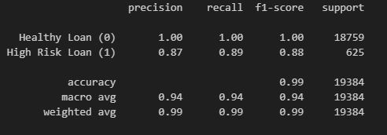
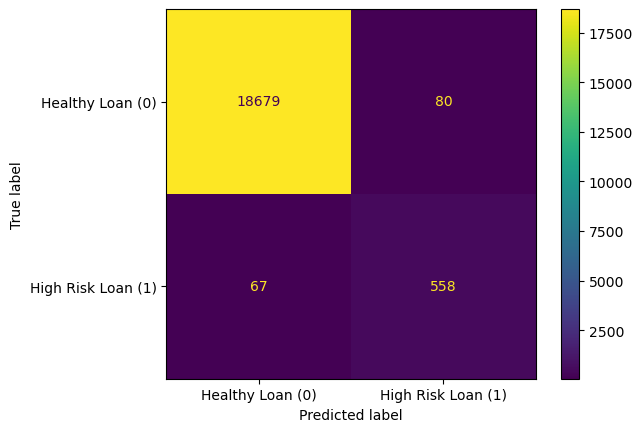

# Module 20 - Credit Risk Classification
*Credit Risk Classification - Supervised Machine Learning Challenge - Week 20 - Data Analytics Boot Camp - University of Oregon*

## Background
I'm using a Logistic Regression Model to train and evaluate a model based on loan risk. I used a dataset of historical lending activity from a peer-to-peer lending services company to build a model that can identify the creditworthiness of borrowers.

## Overview of the Analysis

In this section, describe the analysis you completed for the machine learning models used in this challenge. This might include:

* Explain the purpose of the analysis.
* Explain what financial information the data was on, and what you needed to predict.
* Provide basic information about the variables you were trying to predict (e.g., `value_counts`).
* Describe the stages of the machine learning process you went through as part of this analysis.
* Briefly touch on any methods you used (e.g., `LogisticRegression`, or any other algorithms).

## Results
**Classification Report:**

**Healthy Loan (0):**
- Precision: 1.00 
    - Among all the loans predicted as healthy, 100% are actually healthy.
- Recall: 1.00 
    - Among all the actual healthy loans, 100% are correctly predicted as healthy.

**High Risk Loan (1):**
- Precision: 0.87
    - Among all the loans predicted as high risk, 87% are actually high risk.
- Recall: 0.89
    - Among all the actual high-risk loans, 89% are correctly predicted as high risk.

**Confusion Matrix**

## Summary

This model works very well in predicting healthy loans with perfect precision and recall of 1.  High risk loans also seem to perform well with .87 precision and .89 recall.  Overall, the model achieves a high accuracy of 99%, which suggests it does exceptionally well in distinguishing between healthy and high-risk loans.